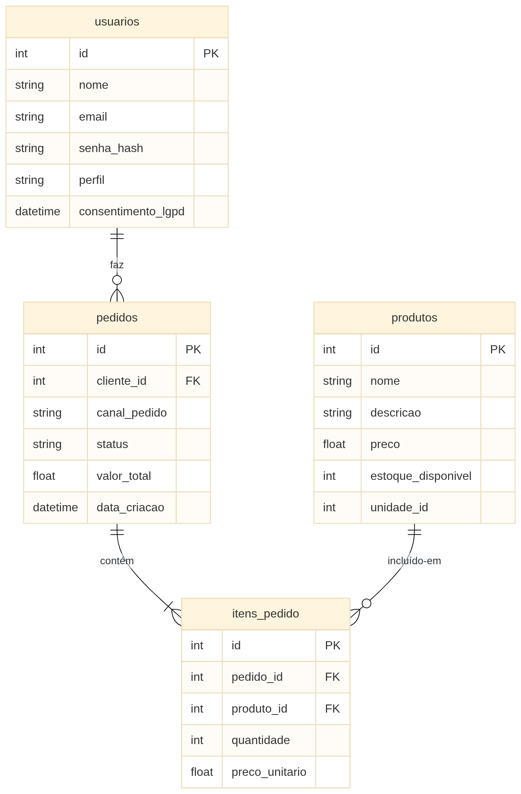
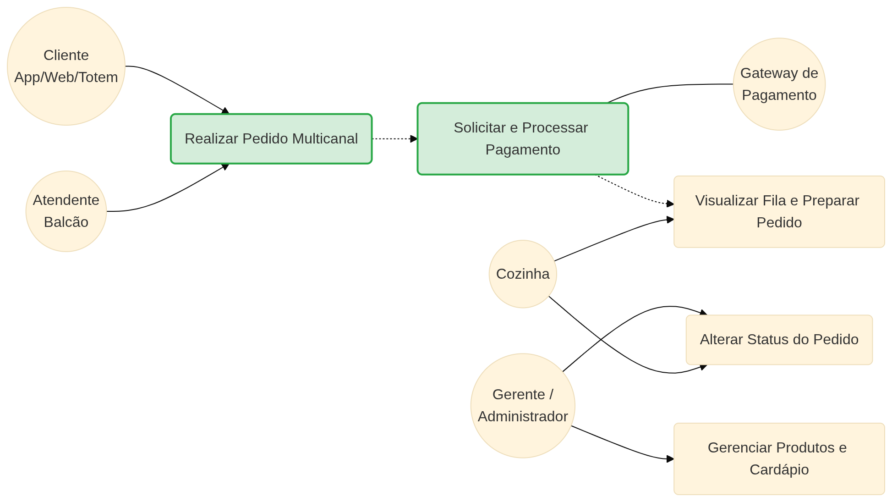

# Sistema Raízes do Nordeste - API Back-end

Interface de programação de aplicativos (API) desenvolvida como solução back-end para o sistema Raízes do Nordeste, estruturada com base nas melhores práticas de arquitetura de software e design RESTful.

## Diagrama de Entidade-Relacionamento (DER)

O modelo relacional do banco de dados garante a integridade referencial do sistema. O diagrama abaixo foi gerado utilizando a sintaxe Mermaid:

<p align="center">
  
</p>

## Diagrama de Casos de Uso

Este diagrama fundamenta a lógica da solução sob a perspectiva dos atores do sistema, mapeando as interações essenciais entre os usuários, a cozinha, a administração e os sistemas externos:

<p align="center">
  
</p>

### Descrição de Feature Crítica: Realizar Pedido Multicanal & Processar Pagamento

* **Atores Envolvidos:** Cliente (via App/Web/Totem), Atendente (via Balcão) e Sistemas Externos de Pagamento (Gateway).
* **Fluxo Principal:** O cliente ou atendente seleciona itens do cardápio informando as quantidades desejadas. O sistema valida as restrições contratuais de multicanalidade, calcula o valor total de forma transacional e aciona o Gateway de pagamento para processamento seguro.
* **Tratamento de Exceções & Regras de Negócio:**
  * **Estoque Insuficiente:** Caso a quantidade solicitada ultrapasse o estoque físico disponível no banco de dados, a operação é abortada imediatamente disparando uma resposta `409 Conflict`.
  * **Falha de Contrato:** Entradas inválidas ou canais de venda fora do escopo padrão disparam validações automáticas da camada HTTP, respondendo com `422 Unprocessable Entity` antes de onerar a infraestrutura.

## Tecnologias Utilizadas

O projeto foi construído utilizando o ecossistema moderno do Python para o desenvolvimento de APIs assíncronas:

- **Python**: Linguagem de programação base do ecossistema.
- **FastAPI**: Framework web moderno e de alta performance para construção de APIs
- **SQLAlchemy**: ORM (Mapeamento Objeto-Relacional) para gerenciamento e persistência de dados
- **SQLite**: Banco de dados relacional local (arquivo `raizes_nordeste.db`)
- **Pydantic**: Biblioteca para validação de dados e garantia dos contratos/schemas
- **JWT (JSON Web Tokens)**: Padrão utilizado para simulação de autenticação e controle de acesso baseado em perfis
- **Uvicorn**: Servidor ASGI de produção para execução da aplicação.

## Características do Projeto

- **Arquitetura em 4 Camadas**: Divisão clara de responsabilidades entre as camadas de Domínio (Domain), Aplicação (Application), Infraestrutura (Infrastructure) e Interface (API).
- **Persistência Real**: Integração com banco de dados SQLite utilizando o SQLAlchemy ORM, garantindo operações CRUD reais e consistentes.
- **Carga Inicial Automática (Seed)**: Inicialização inteligente que popula a base de dados com itens de teste do cardápio logo no primeiro início do servidor.
- **Validação de Multicanalidade**: Controle estrito e padronizado do contrato de pedidos, restringindo as entradas aos canais permitidos (APP, TOTEM, BALCAO, PICKUP, WEB).
- **Segurança Baseada em Perfis (RBAC)**: Mecanismo de simulação de autenticação com distinção de privilégios para perfis de Cliente e Administrador.
- **Tratamento Global de Erros**: Respostas JSON padronizadas para qualquer falha, contendo chaves consistentes para rastreabilidade (error, message, details, timestamp, path).

---

## Estrutura do Projeto (Arquitetura em Camadas)

O código-fonte da API está organizado seguindo os princípios de separação de responsabilidades. Abaixo está a árvore de diretórios exata do repositório:

```text
PROJETO_BACKEND/
├── app/
│   ├── api/                  # Camada de Interface (Controllers, Endpoints e Validações HTTP)
│   │   └── rotas.py
│   ├── application/          # Camada de Aplicação (Casos de Uso e Orquestração do Fluxo de Pedidos)
│   │   └── processar_pedido.py
│   ├── domain/               # Camada de Domínio (Entidades de Negócio e Modelos do ORM)
│   │   └── models.py
│   └── infrastructure/       # Camada de Infraestrutura (Configuração do Banco de Dados e Mocks)
│       ├── database.py
│       └── simulador_pagamento.py
├── .gitignore                # Arquivo de desconsideração para arquivos locais/temporários
├── casos-diagram.png         # Diagrama de Casos de Uso (Mapeamento de Processos e Atores)
├── der-diagram.png           # Diagrama de Entidade-Relacionamento (DER) do Banco de Dados
├── env.example               # Modelo de configuração para variáveis de ambiente
├── main.py                   # Ponto de entrada da aplicação, rotinas de Seed e Servidor Uvicorn
├── raizes_nordeste_postman.json  # Arquivo da suíte automatizada com os 10 cenários de testes
├── README.md                 # Documentação técnica do projeto
└── requirements.txt          # Lista de dependências para instalação simplificada via pip
```

## Governança e Demonstração da LGPD no Back-end

O tratamento de dados pessoais no sistema foi mapeado em total conformidade com as bases legais do Art. 7º da Lei 13.709/2018 (LGPD):

1. **Nome e E-mail:** Tratados sob a base legal de **Execução de Contrato** (Art. 7º, V) para identificação nas comandas da cozinha e envio do comprovante transacional do pedido.
2. **Senha (`senha_hash`):** Tratada para fins de **Segurança da Informação e Prevenção a Fraude** (Art. 7º, II), armazenada via criptografia irreversível.
3. **Consentimento (`consentimento_lgpd`):** Registrado via *timestamp* inequívoco no banco de dados no momento da criação da conta, em conformidade com o Art. 7º, I.
4. **Direito de Eliminação e Auditoria:** O sistema gera logs automatizados no console a cada acesso a dados sensíveis (Perfil) e expõe uma rota de exclusão/anonimização dos dados a pedido do titular.

---

## Como Executar o Ambiente Local

1. Clonar o repositório:
   ```
   git clone https://github.com/a-f-mad/api-raizes-nordeste.git
   cd api-raizes-nordeste
   ```
2. Criar o ambiente virtual (venv):

   ```
   python -m venv .venv
   ```

3. Ativar o ambiente virtual:

   - No Windows (Prompt de Comando ou PowerShell):

   ```
    .venv\Scripts\activate
   ```

   - No Linux / macOS:

   ```
    source .venv/bin/activate
   ```

4. Instalar as dependências do projeto:

   ```
   pip install -r requirements.txt
   ```

5. Iniciar o servidor de desenvolvimento:

   Copie o arquivo .env.example para .env se quiser customizar o servidor

   ```
   python main.py
   ```

6. Acessar a documentação:
   Com o servidor rodando, abra o navegador e acesse a interface interativa do Swagger UI:

   http://127.0.0.1:8000/docs

## Testes Postman

O repositório inclui o arquivo `raizes_nordeste_postman.json` contendo 10 cenários.

**Ordem sugerida para execução:**

1. Execute `T06` para validar a listagem inicial populada pelo Seed automático.
2. Execute `T01`, `T02` e `T03` para checar as barreiras e roles de segurança/LGPD.
3. Execute `T07` para simular a compra com integração de pagamento aprovado.
4. Rode os testes negativos (`T04`, `T05`, `T08`, `T09`) para comprovar o tratamento erros

## Credenciais de Teste

Para testar a segurança e as regras de negócio diretamente pela interface do Swagger, utilize os seguintes parâmetros na URL (Query):

- Perfil Cliente: Bearer TOKEN_CLIENTE (Permite realizar pedidos)
- Perfil Administrador: Bearer TOKEN_ADMIN (Permite gerenciar produtos no CRUD)

## Contrato da API e Especificação de Endpoints

Esta seção detalha o contrato técnico entre as camadas do sistema, mapeando as rotas, os requisitos de autenticação por perfil, as estruturas de entrada/saída e as respostas esperadas.

### Recurso: Autenticação & Usuários (`/api/v1/auth`)

| Parâmetro Técnico | Detalhamento do Endpoint |
| :--- | :--- |
| **Descrição** | Simulação de validação de credenciais e escopo de acesso. |
| **Rota e Método** | `POST /api/v1/auth/login` |
| **Autenticação** | Pública (Sem Token) |
| **Request Body (JSON)** | `{"email": "cliente@email.com", "senha": "123"}` |
| **Response Sucesso (200 OK)** | `{"token": "Bearer TOKEN_CLIENTE", "perfil": "CLIENTE"}` |
| **Status Codes Possíveis** | `200` (Sucesso), `401` (Invalido), `422` (Contrato Errado) |

---

### Recurso: Cardápio e Produtos (`/api/v1/produtos`)

| Parâmetro Técnico | Detalhamento do Endpoint |
| :--- | :--- |
| **Descrição** | Listagem dinâmica dos itens ativos do cardápio filtrados por filial da rede. |
| **Rota e Método** | `GET /api/v1/produtos` |
| **Autenticação** | Obrigatória: `Bearer TOKEN_CLIENTE` ou `Bearer TOKEN_ADMIN` |
| **Query Params** | `?unidade_id=1` (Obrigatório para o filtro de localidade) |
| **Response Sucesso (200 OK)** | `[{"id": 1, "nome": "Baião de Dois", "preco": 35.0, "estoque_disponivel": 15}]` |
| **Status Codes Possíveis** | `200` (Sucesso), `401` (Não Autenticado), `404` (Unidade Não Encontrada) |

---

### Recurso: Pedidos & Regras de Negócio (`/api/v1/pedidos`)

| Parâmetro Técnico | Detalhamento do Endpoint |
| :--- | :--- |
| **Descrição** | Processamento transacional de compras, checagem de estoque e multicanalidade. |
| **Rota e Método** | `POST /api/v1/pedidos` |
| **Autenticação** | Restrita: Apenas perfil `CLIENTE` (`Bearer TOKEN_CLIENTE`) |
| **Request Body (JSON)** | `{"canal_pedido": "APP", "itens": [{"produto_id": 1, "quantidade": 2}]}` |
| **Response Sucesso (201 Created)**| `{"id": 12, "status": "COZINHA", "valor_total": 70.0, "timestamp": "2026-06-21T14:45:00"}` |
| **Status Codes Possíveis** | `201` (Criado), `401` (Token Inválido), `403` (Perfil Admin Proibido), `409` (Conflito/Estoque Insuficiente), `422` (Canal de Venda Inválido) |

---

### Padrão Global de Resposta de Erros

Para qualquer falha interceptada pelas regras de negócio ou validações do Pydantic, a API interrompe o fluxo e responde utilizando estritamente a estrutura JSON unificada abaixo, garantindo rastreabilidade:

```json
{
  "error": "NOME_DO_ERRO_HTTP",
  "message": "Mensagem descritiva detalhada para exibição na interface.",
  "details": "Especificação técnica do erro ou campo que falhou no contrato.",
  "timestamp": "2026-06-21T14:45:24.123Z",
  "path": "/api/v1/pedidos"
}
```
